# CX All-in-one - Bản Tổng Hợp Diagram Hệ Thống

## 1. Phạm Vi Review

Tài liệu này gom toàn bộ sơ đồ hệ thống vào một bản để review nhanh:

| Nhóm | Nội dung |
| --- | --- |
| Luồng nghiệp vụ | Sale tạo phiếu, CS kích hoạt, tạo khách hàng, hợp đồng, dịch vụ, dashboard, hủy brandname, báo cáo, cron |
| State nghiệp vụ | Phiếu Sale, khách hàng, hợp đồng, dịch vụ, phiếu hủy brandname |
| Dữ liệu | ERD CX, hợp đồng, dịch vụ, hủy brandname, provider, activity log, config |
| Kiến trúc | Next.js app, server actions, API routes, Supabase, cron scheduler, Google Sheets sync |

Nguồn đối chiếu:

| Nguồn | Vai trò |
| --- | --- |
| `docs/cx-service-term-dashboard-update-plan.md` | Rule BA đã chốt về thời hạn hợp đồng, dịch vụ, gói, dashboard theo kênh và tải SUP |
| `docs/cx-dashboard-overview-metrics-recommendation.md` | Nhóm chỉ số dashboard tổng quan CX |
| `schema.sql` | Bảng dữ liệu, view, quan hệ chính |
| `src/lib/cx-actions.ts` | Action tạo phiếu, kích hoạt, tạo/sửa/gia hạn hợp đồng và dịch vụ, Customer 360, cron |
| `src/app/**` | Màn hình và API route thực tế |

## 2. Toàn Cảnh Hệ Thống

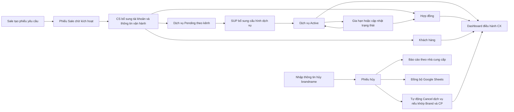

## 3. Luồng Sale Tạo Phiếu Và CS Kích Hoạt

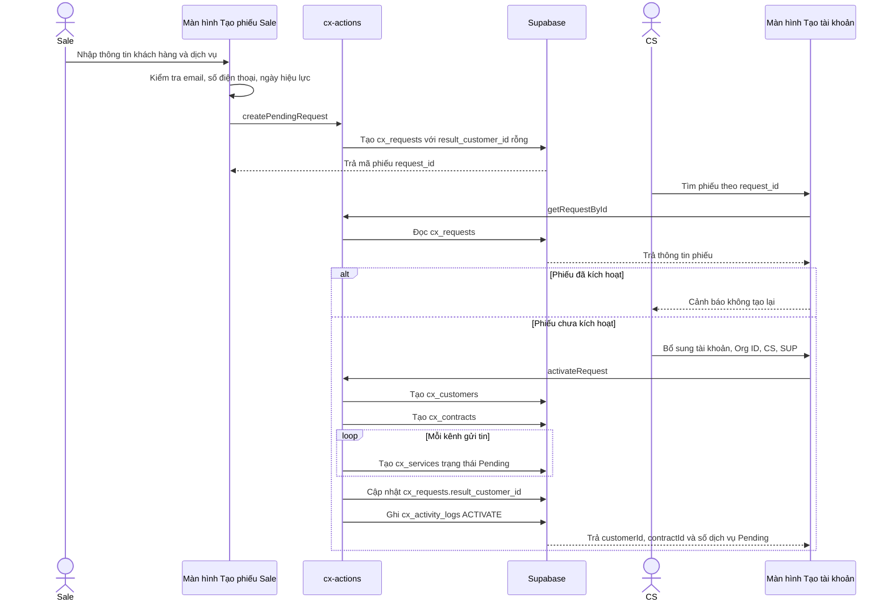

## 4. Luồng Quản Lý Dịch Vụ Và Gia Hạn

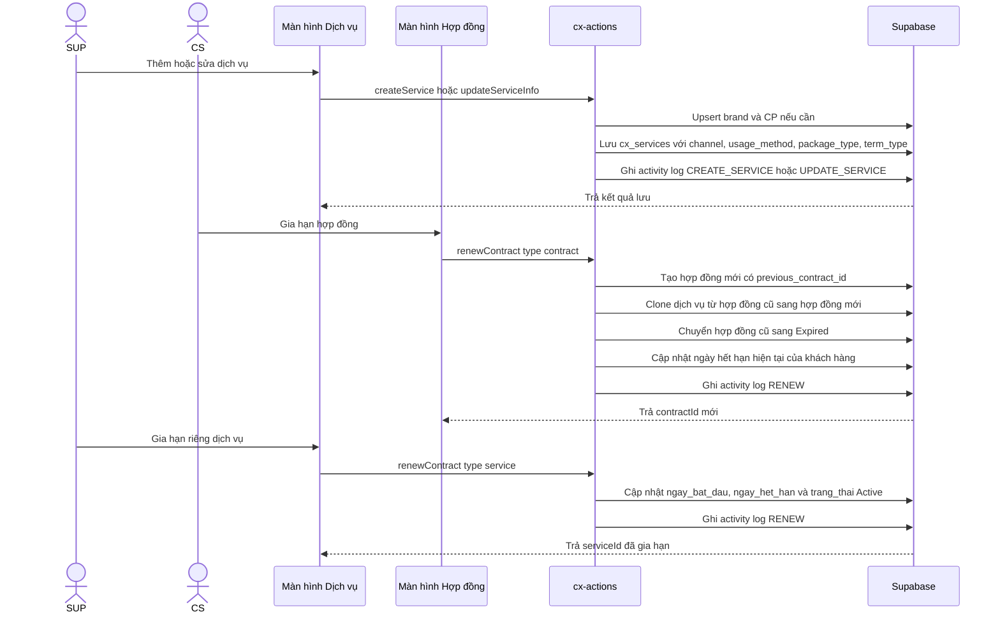

## 5. Luồng Dashboard Điều Hành CX

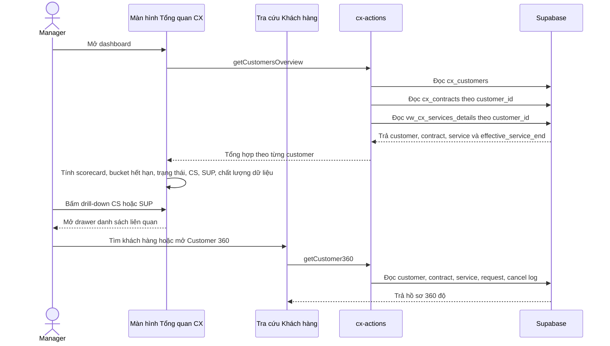

## 6. Luồng Hủy Brandname Và Báo Cáo Nhà Cung Cấp

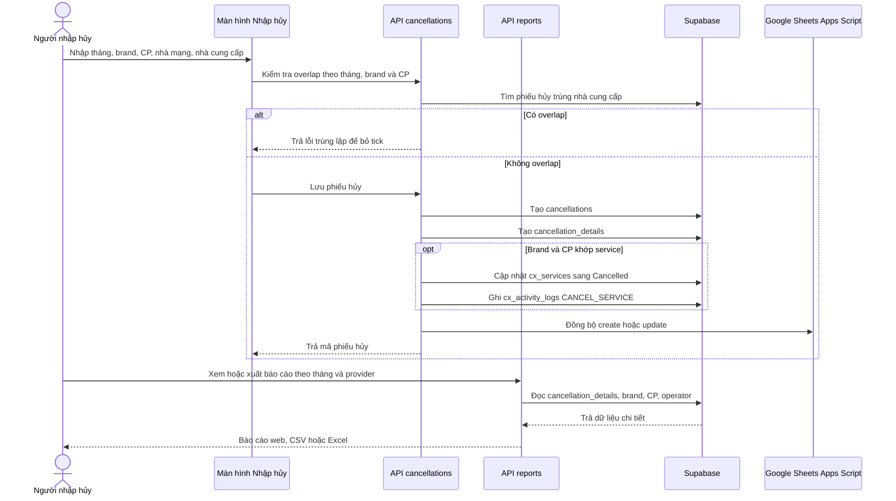

## 7. Luồng Cron Gia Hạn Tự Động

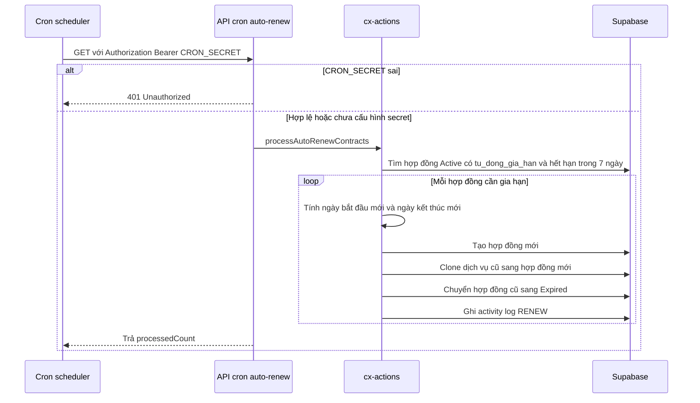

## 8. State Nghiệp Vụ

### 8.1. Phiếu Sale

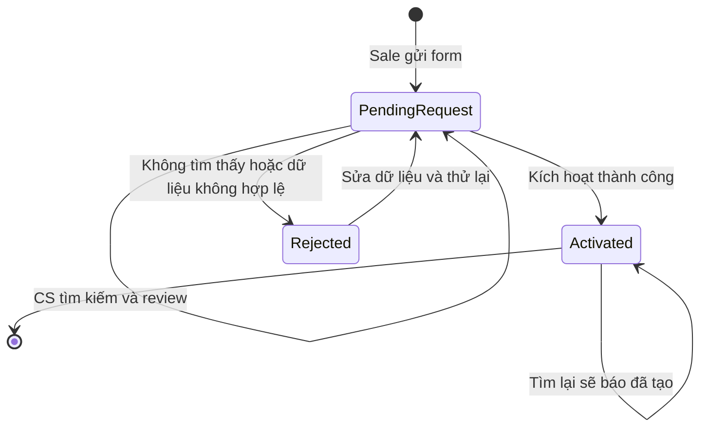

### 8.2. Khách Hàng

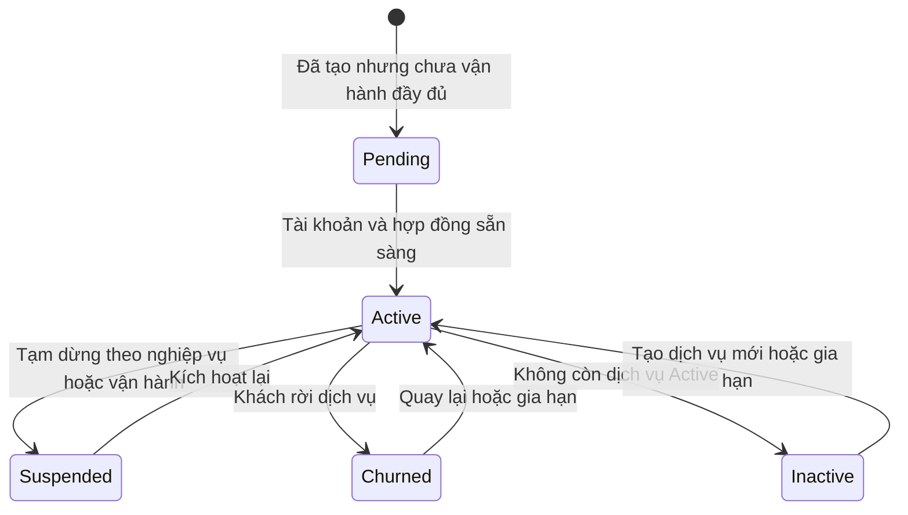

### 8.3. Hợp Đồng

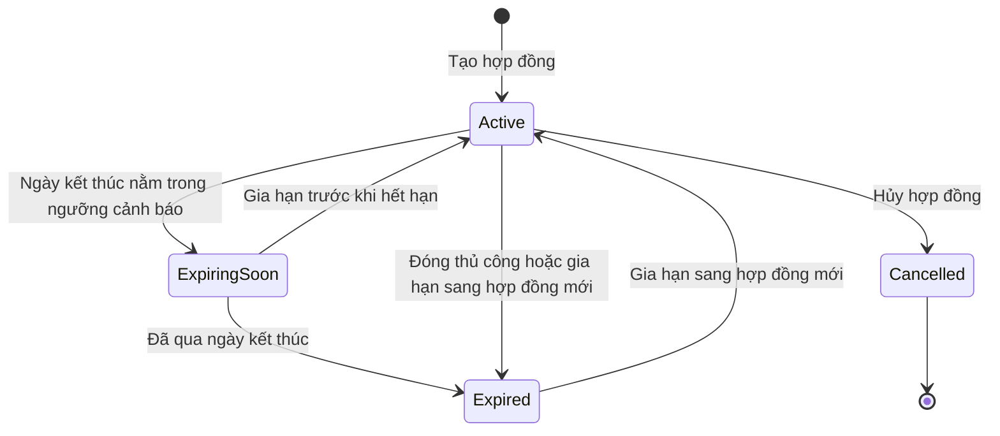

### 8.4. Dịch Vụ

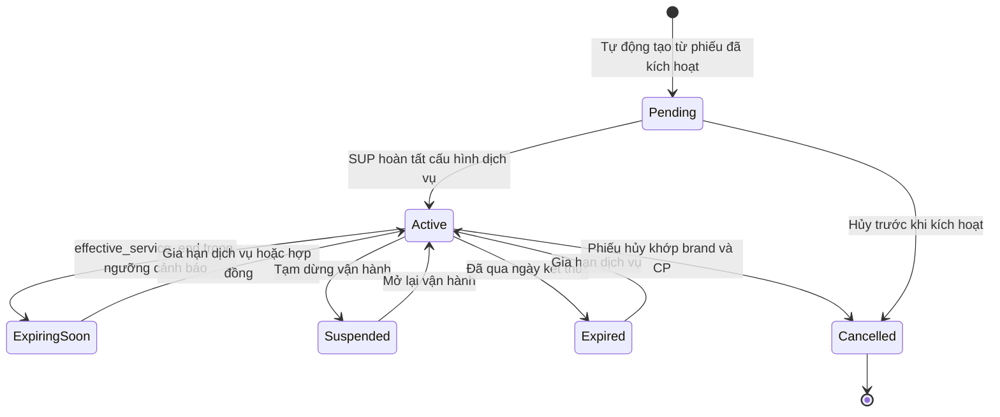

### 8.5. Phiếu Hủy Brandname

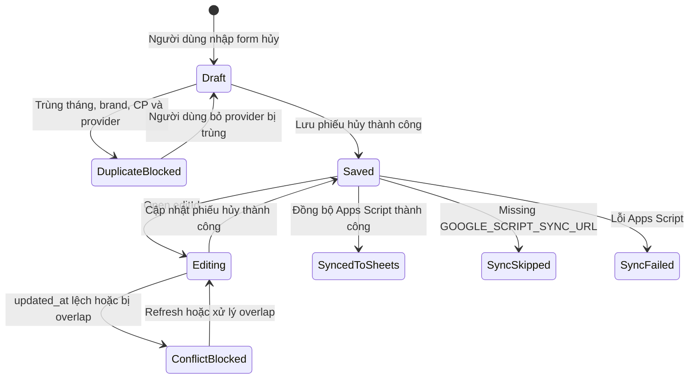

## 9. ERD Tổng Hợp

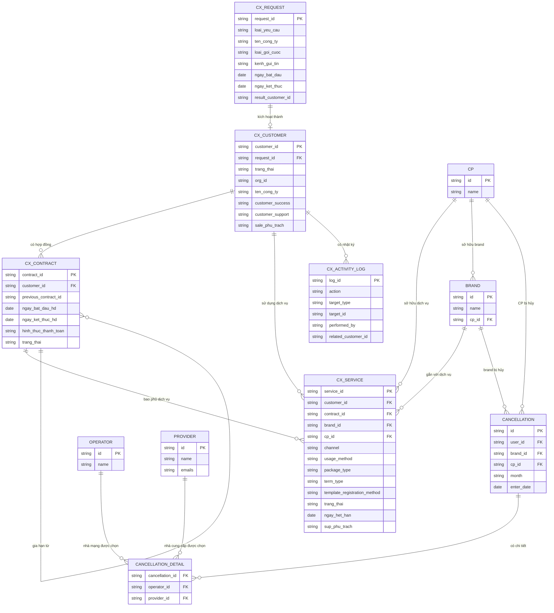

## 10. Kiến Trúc Hệ Thống

```d2
direction: right

users: {
  shape: person
  label: "Người dùng nội bộ"
}

browser: {
  label: "Browser"
  sale: "Form Sale"
  cs: "Kích hoạt CS"
  cx: "Quản lý CX"
  cancel: "Nhập hủy"
  report: "Báo cáo nhà cung cấp"
}

next_app: {
  label: "Next.js app"
  pages: {
    dashboard: "cx/dashboard"
    customers: "cx/customers"
    requests: "cx/requests"
    contracts: "cx/contracts"
    services: "cx/services"
    settings: "cx/settings"
    history: "cx/history"
    nhap_huy: "nhap-huy"
    tra_cuu: "tra-cuu"
    bao_cao: "bao-cao"
  }
  actions: {
    label: "Server actions"
    cx_actions: "src/lib/cx-actions.ts"
  }
  api: {
    label: "API routes"
    lookup: "api/lookup"
    cancellation: "api/cancellations"
    reports: "api/reports"
    cron: "api/cron/auto-renew"
  }
}

supabase: {
  shape: cylinder
  label: "Supabase"
  cx: "Bảng và view CX"
  cancellation: "Bảng hủy brandname"
  rpc: "RPC và index"
}

external: {
  label: "Hệ thống ngoài"
  sheets: "Google Sheets Apps Script"
  scheduler: "Cron scheduler"
}

users -> browser: "Thao tác nghiệp vụ nội bộ"
browser -> next_app.pages: "Điều hướng màn hình"
next_app.pages -> next_app.actions: "Gọi server actions"
next_app.pages -> next_app.api: "Gọi API routes"
next_app.actions -> supabase.cx: "Đọc và ghi dữ liệu CX"
next_app.actions -> supabase.rpc: "Sinh ID và tìm kiếm"
next_app.api -> supabase.cancellation: "Đọc và ghi dữ liệu hủy"
next_app.api -> supabase.cx: "Cancel dịch vụ khớp và ghi log"
external.scheduler -> next_app.api.cron: "Gọi GET theo lịch"
next_app.api.cancellation -> external.sheets: "Đồng bộ nền khi có cấu hình"
```

## 11. Business Rules Cần Review

| ID | Nội dung | Nguồn |
| --- | --- | --- |
| BR-cx-all-in-one-001 | Hợp đồng là khung hiệu lực chính của dịch vụ. | BA đã chốt |
| BR-cx-all-in-one-002 | `effective_service_end` nên dùng ngày nhỏ nhất giữa ngày kết thúc hợp đồng và ngày hết hạn dịch vụ hoặc gói. | BA đã chốt |
| BR-cx-all-in-one-003 | Dịch vụ hoặc gói vượt hạn hợp đồng cần cảnh báo, không tự động tính active hợp lệ sau hạn hợp đồng. | BA đã chốt |
| BR-cx-all-in-one-004 | Sale tạo phiếu, CS kích hoạt thành customer và contract, hệ thống sinh dịch vụ Pending theo từng kênh. | Code hiện hữu |
| BR-cx-all-in-one-005 | Phiếu đã có `result_customer_id` không được kích hoạt lại. | Code hiện hữu |
| BR-cx-all-in-one-006 | Phiếu hủy brandname bị chặn nếu trùng tháng, brand, CP, nhà cung cấp đã chọn. | Code hiện hữu |
| BR-cx-all-in-one-007 | Khi phiếu hủy match brand và CP, dịch vụ liên quan chuyển sang `Cancelled` và ghi log. | Code hiện hữu |
| BR-cx-all-in-one-008 | Dashboard không hiển thị chỉ số ảo nếu chưa có dữ liệu nguồn. | BA đã chốt |

## 12. Điểm Lệch Cần Chốt

| ID | Vấn đề | Gợi ý |
| --- | --- | --- |
| OQ-cx-all-in-one-001 | Module hủy brandname và báo cáo nhà cung cấp có liên kết sang `cx_services`, nhưng chưa nằm rõ trong tài liệu BA dashboard. | Chốt là module trong scope CX hay tách feature riêng |
| OQ-cx-all-in-one-002 | BA dùng `template_registration_method`: `customer_self_service`, `sup_manual`, `not_required`; UI hiện có `provider_approval`, `zalo_approval`, `not_required`. | Đồng bộ danh mục trước khi làm dashboard tải SUP |
| OQ-cx-all-in-one-003 | BA dùng `term_type`: `contract_bound`, `package_bound`, `technical_tracking`; UI hiện có `contract_bound`, `independent`. | Đồng bộ danh mục trước khi tính hiệu lực |
| OQ-cx-all-in-one-004 | View `vw_cx_services_details` hiện dùng `COALESCE(package_end_date, ngay_het_han, ngay_ket_thuc_hd)`, chưa lấy ngày nhỏ nhất với hợp đồng. | Sửa view để khớp rule `effective_service_end` |
| OQ-cx-all-in-one-005 | Cron auto-renew dùng `tu_dong_gia_han` và `chu_ky_gia_han`, nhưng schema gốc không thấy hai trường này. | Xác nhận migration thực tế trước khi bật cron |

## 13. Lệnh Verify Sau Khi Có Mermaid CLI

```powershell
node C:\Users\TungLD\.codex\skills\antigravity-diagram-kit\scripts\mermaid-verify.mjs --file "D:\T\Vibe code\CX_All-in-one\docs\cx-all-in-one\cx-all-in-one-system-diagrams.md"
```
