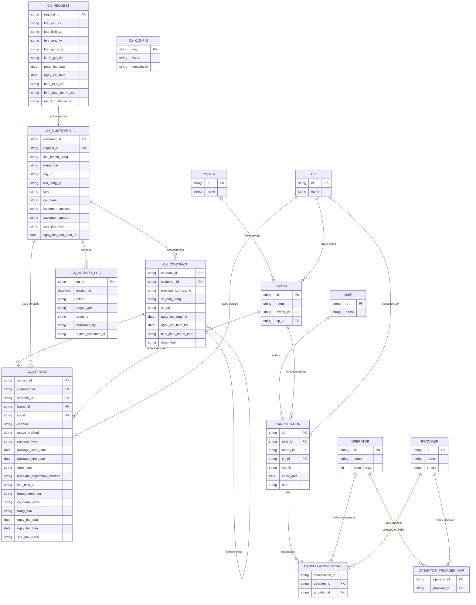

# CX All-in-one ERD

## Entity Relationship Diagram

## Derived Views And Business Meaning

| View hoặc cấu trúc | Vai trò |
| --- | --- |
| `vw_cx_services_details` | Gộp dịch vụ với hợp đồng để dashboard lấy `ngay_ket_thuc_hd` và `effective_service_end` |
| `search_customers_fast` | RPC tìm nhanh theo khách hàng và dịch vụ |
| `cx_config` | Danh mục dropdown động cho UI CX |
| `operator_provider_map` | Cấu hình nhà mạng và nhà cung cấp dùng cho form hủy |

## Review Notes

| Chủ đề | Ghi chú |
| --- | --- |
| Quan hệ request và customer | DB có `cx_customers.request_id` trỏ về request, còn `cx_requests.result_customer_id` lưu kết quả kích hoạt. |
| Quan hệ service và hợp đồng | Service có thể thiếu `contract_id`, dashboard đang dùng nhóm này làm cảnh báo chất lượng dữ liệu. |
| Brand và CP dùng chung | Module hủy brandname và module dịch vụ cùng dùng `brands` và `cps`, nên có liên kết nghiệp vụ giữa hủy và trạng thái service. |
| Activity log | Đang là bảng nhật ký chung cho activation, create, update, renew và cancel service. |
| Config | Danh mục nghiệp vụ nhiều nơi lấy từ `cx_config`, fallback nằm trong `src/lib/constants.ts`. |
