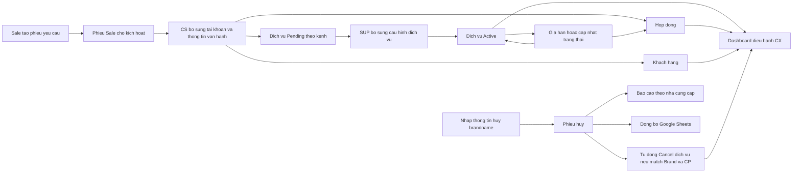
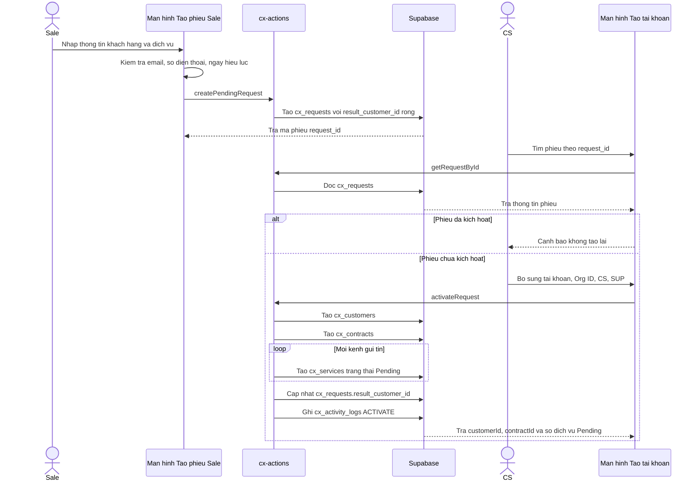
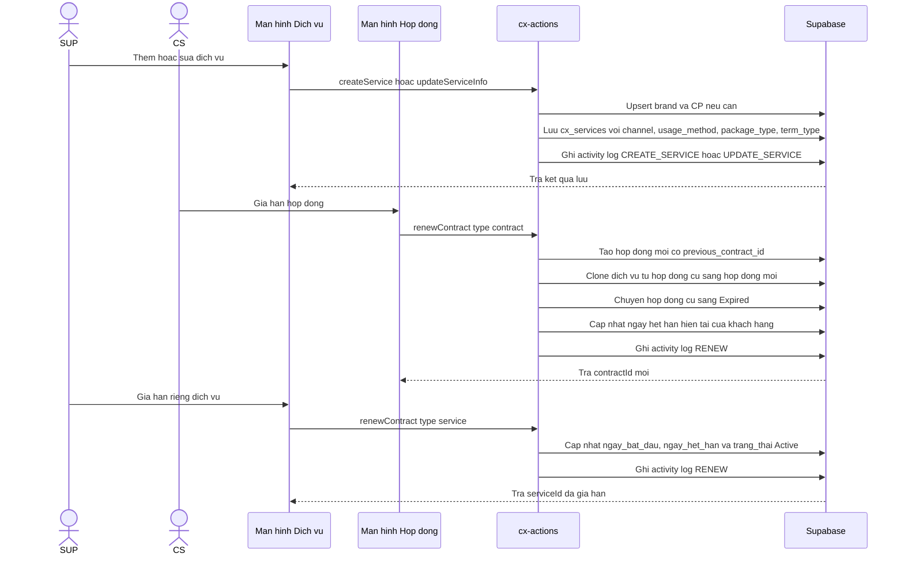
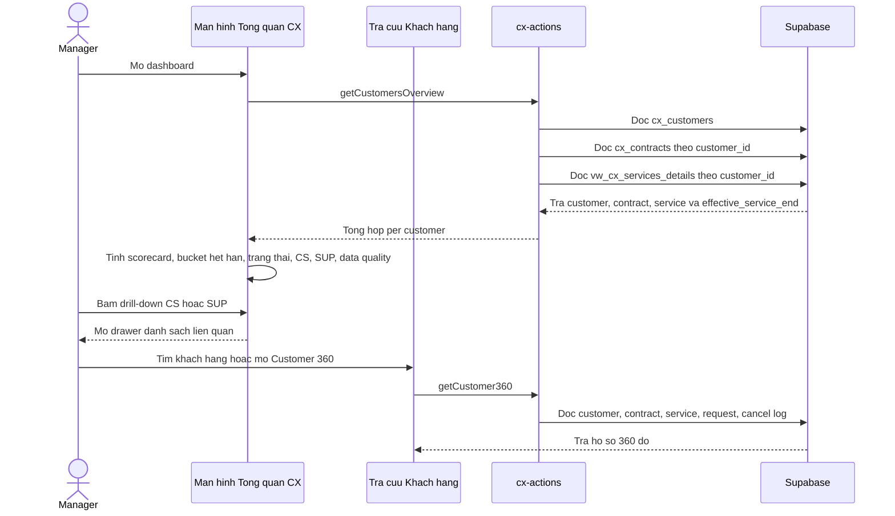
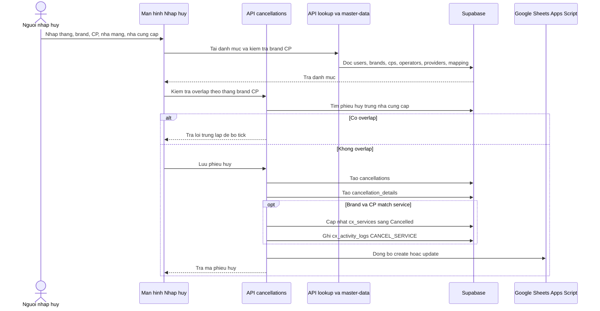
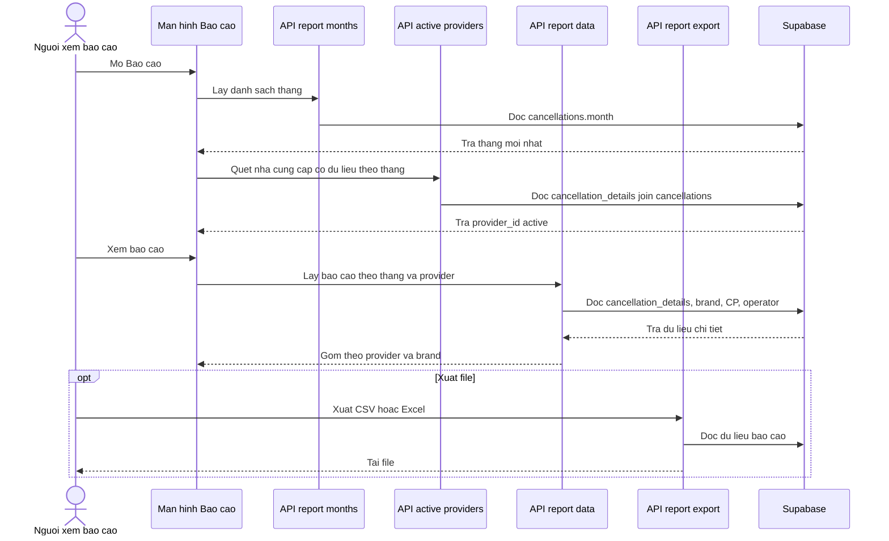
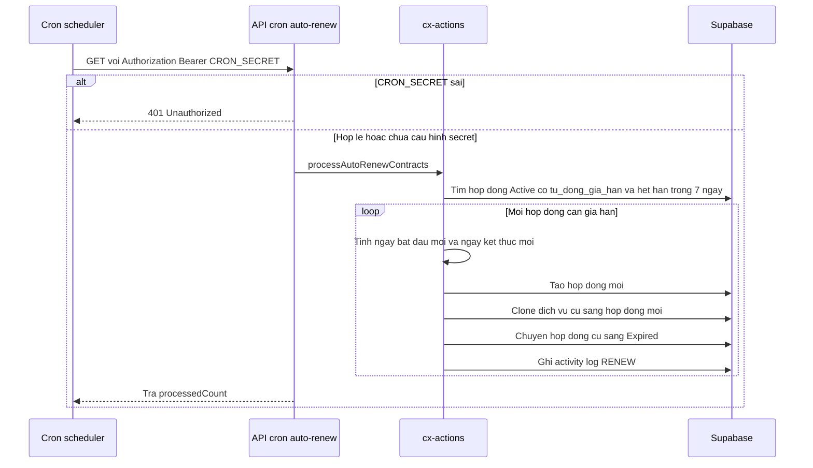

# CX All-in-one Flows

## Source Scope

Tài liệu này vẽ lại hệ thống từ hai nguồn:

| Nhóm | Nguồn | Ghi chú review |
| --- | --- | --- |
| Nghiệp vụ đã chốt | `docs/cx-service-term-dashboard-update-plan.md` | Thời hạn hợp đồng, dịch vụ, gói, dashboard theo kênh và tải SUP |
| Dashboard đề xuất | `docs/cx-dashboard-overview-metrics-recommendation.md` | Nhóm chỉ số tổng quan, rủi ro, trạng thái, CS, SUP, chất lượng dữ liệu |
| Code và schema hiện hữu | `schema.sql`, `src/lib/cx-actions.ts`, `src/app/**` | Xác nhận module, bảng, action, API route và luồng đang có trong hệ thống |

## Flow: Toàn Cảnh Nghiệp Vụ

## Flow: Sale Tạo Phiếu Và CS Kích Hoạt

## Flow: Quản Lý Dịch Vụ Và Gia Hạn

## Flow: Dashboard Điều Hành CX

## Flow: Hủy Brandname Và Đồng Bộ Dịch Vụ

## Flow: Báo Cáo Hủy Theo Nhà Cung Cấp

## Flow: Cron Gia Hạn Tự Động

## Business Rules For Review

| ID | Nội dung | Nguồn |
| --- | --- | --- |
| BR-cx-all-in-one-001 | Hợp đồng là khung hiệu lực chính của dịch vụ. | BA đã chốt |
| BR-cx-all-in-one-002 | `effective_service_end` dùng ngày nhỏ nhất giữa ngày kết thúc hợp đồng và ngày hết hạn dịch vụ hoặc gói. | BA đã chốt |
| BR-cx-all-in-one-003 | Dịch vụ hoặc gói vượt hạn hợp đồng cần cảnh báo, không tự động tính active hợp lệ sau hạn hợp đồng. | BA đã chốt |
| BR-cx-all-in-one-004 | Sale tạo phiếu, CS kích hoạt thành customer và contract, hệ thống sinh dịch vụ Pending theo từng kênh. | Code hiện hữu |
| BR-cx-all-in-one-005 | Phiếu đã có `result_customer_id` không được kích hoạt lại. | Code hiện hữu |
| BR-cx-all-in-one-006 | Phiếu hủy brandname bị chặn nếu trùng tháng, brand, CP, nhà cung cấp đã chọn. | Code hiện hữu |
| BR-cx-all-in-one-007 | Khi phiếu hủy match brand và CP, dịch vụ liên quan chuyển sang `Cancelled` và ghi log. | Code hiện hữu |
| BR-cx-all-in-one-008 | Dashboard không hiển thị chỉ số ảo nếu chưa có dữ liệu nguồn. | BA đã chốt |

## Open Questions

| ID | Câu hỏi | Gợi ý review |
| --- | --- | --- |
| OQ-cx-all-in-one-001 | Module hủy brandname và báo cáo nhà cung cấp có thuộc phạm vi BA chính của CX All-in-one không? | Code đang liên kết sang `cx_services`, nên nên đưa vào scope hoặc tách feature riêng |
| OQ-cx-all-in-one-002 | `template_registration_method` trong BA là `customer_self_service`, `sup_manual`, `not_required`, nhưng UI hiện có `provider_approval`, `zalo_approval`, `not_required`. | Cần chốt lại danh mục chuẩn |
| OQ-cx-all-in-one-003 | `term_type` trong BA là `contract_bound`, `package_bound`, `technical_tracking`, nhưng UI hiện có `contract_bound`, `independent`. | Cần đồng bộ danh mục |
| OQ-cx-all-in-one-004 | View `vw_cx_services_details` hiện dùng `COALESCE(package_end_date, ngay_het_han, ngay_ket_thuc_hd)`, chưa lấy ngày nhỏ nhất với hợp đồng. | Cần kiểm tra lại với rule `effective_service_end` |
| OQ-cx-all-in-one-005 | Cron auto-renew phụ thuộc trường `tu_dong_gia_han` và `chu_ky_gia_han`, nhưng schema gốc không thấy hai trường này. | Cần xác nhận migration thực tế |
