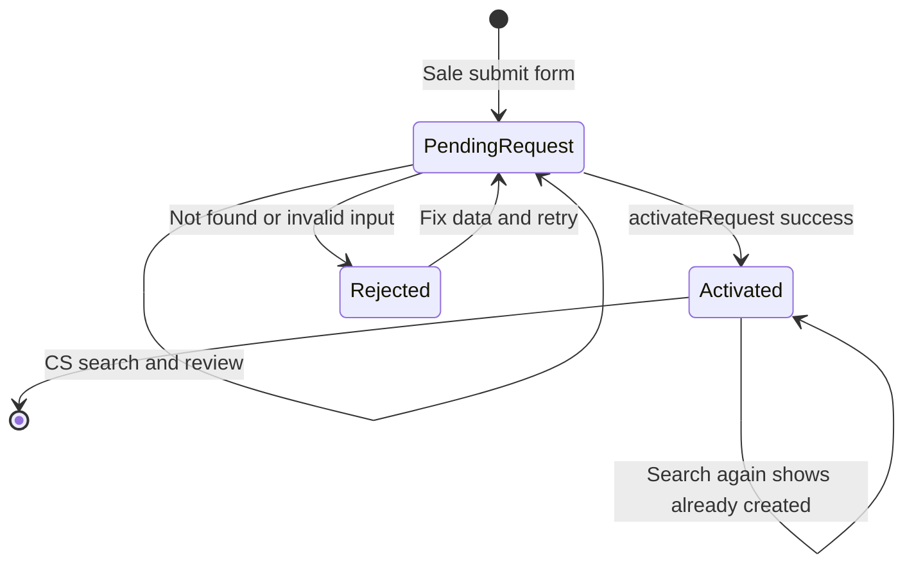
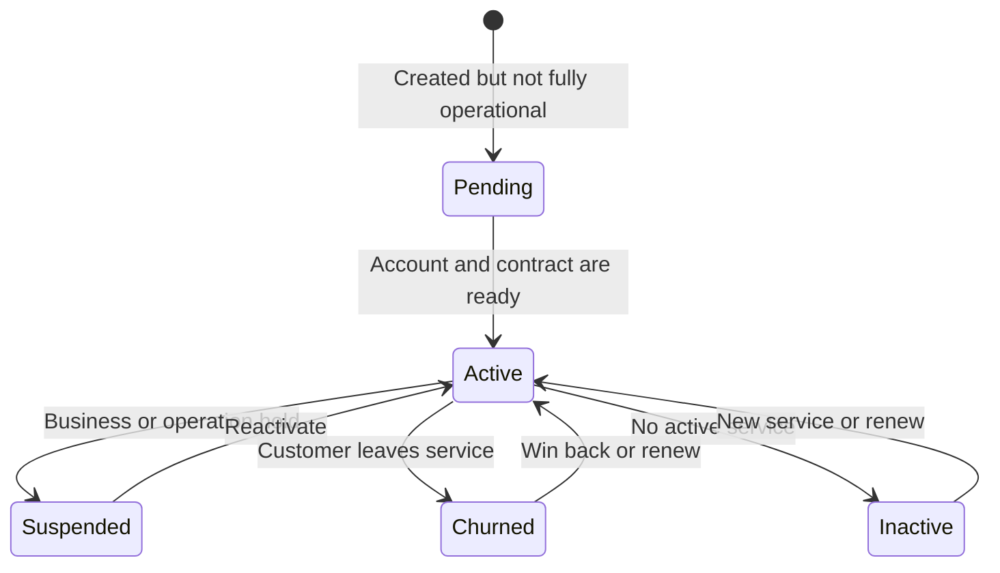
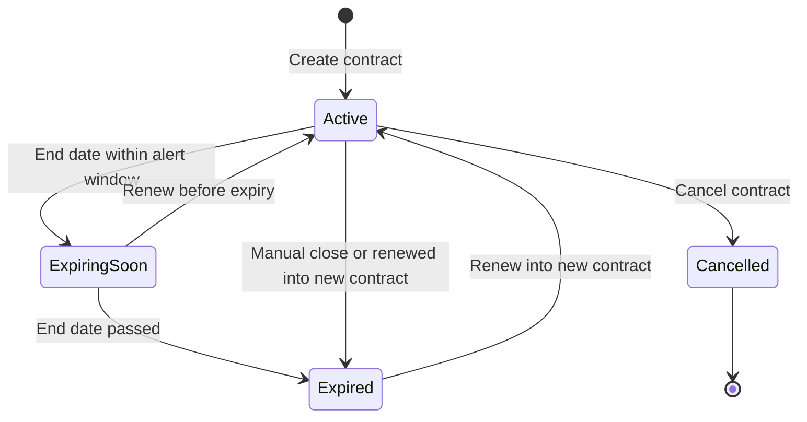
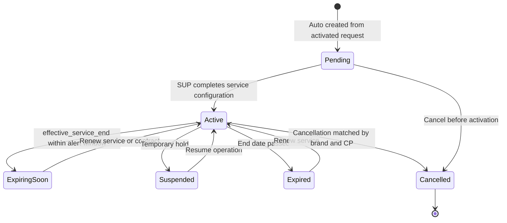
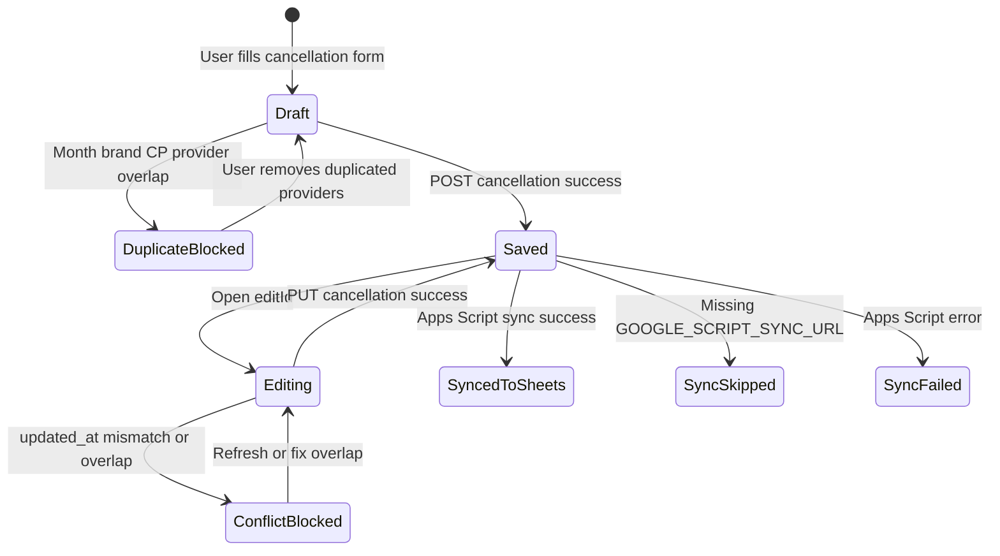

# CX All-in-one States

## State: Phiếu Sale

| State | Điều kiện dữ liệu | Ghi chú |
| --- | --- | --- |
| PendingRequest | `cx_requests.result_customer_id` rỗng | Chờ CS kích hoạt |
| Activated | `result_customer_id` đã có mã khách hàng | Không cho tạo lại |
| Rejected | Lỗi tìm phiếu hoặc lỗi dữ liệu khi kích hoạt | Không phải trạng thái lưu cứng trong DB |

## State: Khách Hàng

| State | Nguồn | Ghi chú |
| --- | --- | --- |
| Active | `cx_customers.trang_thai` hoặc suy từ dịch vụ active trong `getCustomersOverview` | Dashboard đang hiển thị khách active |
| Pending | Danh mục fallback có giá trị `Pending` | Cần chốt cách dùng |
| Suspended | Danh mục fallback có giá trị `Suspended` | Cần chốt rule treo |
| Churned | Danh mục fallback có giá trị `Churned` | Nên liên kết event `CHURN` khi có lịch sử |
| Inactive | Code suy luận khi không có dịch vụ Active | Có thể không lưu trực tiếp trong DB |

## State: Hợp Đồng

| State | Điều kiện dữ liệu | Ghi chú |
| --- | --- | --- |
| Active | `cx_contracts.trang_thai = Active` | Được tính vào dashboard active |
| ExpiringSoon | `ngay_ket_thuc_hd` trong bucket cảnh báo | State nghiệp vụ hiển thị, không nhất thiết lưu DB |
| Expired | `trang_thai = Expired` hoặc hợp đồng cũ sau gia hạn | Code chuyển hợp đồng cũ sang Expired |
| Cancelled | `trang_thai = Cancelled` | Có trong UI hợp đồng |

## State: Dịch Vụ

| State | Điều kiện dữ liệu | Ghi chú |
| --- | --- | --- |
| Pending | `cx_services.trang_thai = Pending` | Được sinh tự động khi kích hoạt phiếu |
| Active | `trang_thai = Active` | Dashboard tính active và rủi ro hết hạn |
| Suspended | Danh mục fallback có giá trị `Suspended` | UI service filter chưa luôn liệt kê Suspended |
| ExpiringSoon | `effective_service_end` trong bucket cảnh báo | Theo BA nên dùng effective end |
| Expired | `trang_thai = Expired` hoặc ngày hết hạn đã qua | Dashboard có bucket quá hạn |
| Cancelled | `trang_thai = Cancelled` | API hủy brandname tự động chuyển trạng thái khi match brand và CP |

## State: Phiếu Hủy Brandname

| State | Điều kiện | Ghi chú |
| --- | --- | --- |
| Draft | Form chưa lưu | Không lưu DB |
| DuplicateBlocked | API trả 409 do overlap | Chặn lưu trùng |
| Saved | Có bản ghi `cancellations` và `cancellation_details` | Có thể đã cập nhật `cx_services` sang Cancelled |
| ConflictBlocked | Edit bị stale hoặc overlap | Bảo vệ khi nhiều người sửa |
| SyncedToSheets | Sync nền thành công | Không block kết quả lưu chính |
| SyncSkipped | Chưa cấu hình URL sync | Có log cảnh báo |
| SyncFailed | Apps Script lỗi | Có log lỗi, bản ghi chính vẫn đã lưu |
